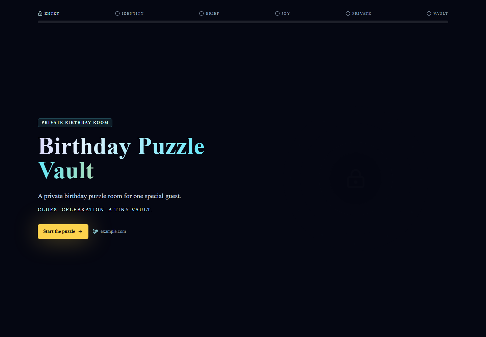
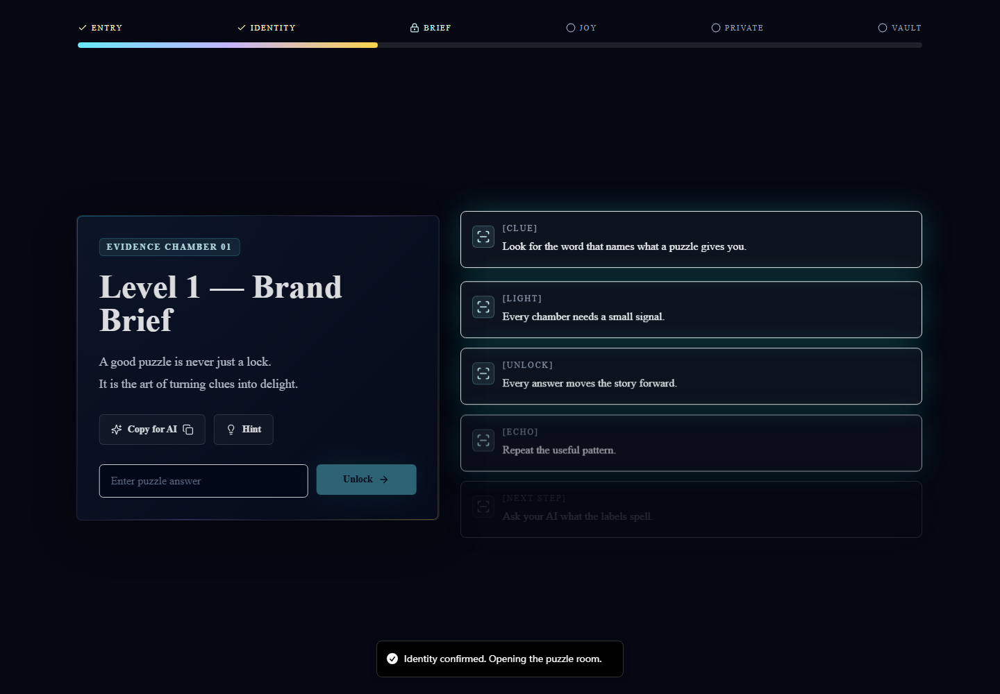
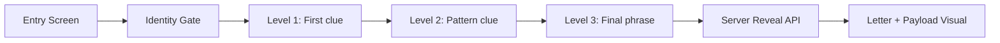

# Birthday Puzzle Vault

English | [中文](README_zh.md)


A cinematic birthday puzzle web app built with Next.js, Tailwind CSS, Framer Motion, and shadcn-style UI primitives.

Players pass an identity gate, solve three puzzle stages, and unlock a final vault reveal with a letter and configurable payload panel. The project is designed as a polished, personal celebration page that can be adapted for birthdays, private events, or puzzle-based microsites.

---

## Screenshots

### Entry Screen



### Puzzle Flow



## Key Highlights

| Feature | Description |
| --- | --- |
| Cinematic puzzle flow | Multi-step single-page experience with progress rail, animated panels, hints, and AI prompt copy buttons. |
| Controlled final reveal | The reveal panel is fetched only after the final phrase is accepted by the server API. |
| Configurable payload panel | Use environment variables for local demos or private deployments. |
| Polished vault moment | A high-detail treasure chest image, particle effects, letter, and payload visual appear at the reveal step. |
| Responsive UI | Built for desktop and mobile with Tailwind CSS and Playwright coverage. |

---

## Flow



---

## Tech Stack

- Next.js App Router
- React 19
- TypeScript
- Tailwind CSS
- Framer Motion
- lucide-react
- Vitest
- Playwright

---

## Local Development

Install dependencies:

```bash
npm install
```

Start the local development server:

```bash
npm run dev
```

Open:

```text
http://127.0.0.1:3026
```

---

## Environment Variables

Create a local `.env.local` only when you want to test the final reveal panel:

```bash
VAULT_PAYLOAD="DEMO-PLACEHOLDER-PAYLOAD"
FINAL_LETTER_CN="Happy birthday. Keep creating, keep exploring."
FINAL_LETTER_EN="Happy birthday. Keep creating, keep exploring."
FINAL_LETTER_CN_B64=""
FINAL_LETTER_EN_B64=""
PANEL_TITLE="Vault Payload"
PANEL_SUBTITLE="A private reveal payload"
VAULT_GATE_ANSWER=""
VAULT_LEVEL1_ANSWER=""
VAULT_LEVEL2_ANSWER=""
VAULT_FINAL_ANSWER=""
NEXT_PUBLIC_SITE_URL="https://example.com"
NEXT_PUBLIC_BASE_PATH=""
```

For public demos and screenshots, use placeholder values.

`FINAL_LETTER_CN`, `FINAL_LETTER_EN`, `FINAL_LETTER_CN_B64`, `FINAL_LETTER_EN_B64`, `PANEL_TITLE`, and `PANEL_SUBTITLE` are optional. If omitted, the app uses neutral default birthday copy and payload labels. Use the Base64 variants when your letter needs multiple lines.

---

## Verification

Run the full local verification suite:

```bash
npm run lint
npm test
npm run build
npm run test:ui
```

The Playwright suite covers desktop and mobile puzzle flows.

---

## Deployment Notes

The final payload panel is returned by `POST /api/reveal` after the accepted final phrase is submitted. The frontend does not store reveal data in `localStorage` or `sessionStorage`.

Use `.env.example` as a template for local development and keep deployment-specific settings outside the repository.

---

## Project Structure

```text
app/                  Next.js app routes and API reveal endpoint
components/           UI components, puzzle panels, vault reveal, visual effects
lib/                  Puzzle data, answer normalization, env helpers
public/assets/        Public visual assets
tests/                Vitest and Playwright coverage
docs/screenshots/     README screenshots
```

---

## License

Apache License 2.0. See [LICENSE](LICENSE).
