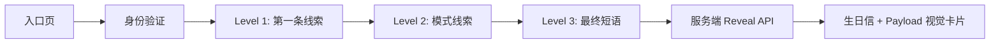

# Birthday Puzzle Vault

[English](README.md) | 中文


一个电影感生日解谜网页。项目使用 Next.js、Tailwind CSS、Framer Motion 和 shadcn 风格 UI 组件构建。

玩家会依次通过身份验证、三道谜题，最后打开宝箱，看到生日信和可配置的揭示面板。这个项目适合改造成生日祝福、私人活动页或带解谜流程的轻量 microsite。

---

## 截图

### 入口页


### 谜题流程


## 核心亮点

| 功能 | 说明 |
| --- | --- |
| 电影感解谜流程 | 单页多阶段体验，包含进度条、动画卡片、提示面板和 Copy for AI 按钮。 |
| 受控最终揭示 | 只有最终短语通过后，前端才会向服务端 reveal API 请求揭示内容。 |
| 可配置揭示面板 | 可通过环境变量配置本地演示或私人部署需要展示的内容。 |
| 高质感宝箱时刻 | 最终页使用高细节宝箱图、粒子光效、信件和 payload 视觉卡片。 |
| 响应式体验 | Tailwind CSS 构建，Playwright 覆盖桌面和移动端流程。 |

---

## 流程



---

## 技术栈

- Next.js App Router
- React 19
- TypeScript
- Tailwind CSS
- Framer Motion
- lucide-react
- Vitest
- Playwright

---

## 本地开发

安装依赖：

```bash
npm install
```

启动本地开发服务：

```bash
npm run dev
```

打开：

```text
http://127.0.0.1:3026
```

---

## 环境变量

只有在本地测试最终揭示面板时，才需要创建 `.env.local`：

```bash
VAULT_PAYLOAD="DEMO-PLACEHOLDER-PAYLOAD"
FINAL_LETTER_CN="生日快乐。继续创造，继续探索。"
FINAL_LETTER_EN="Happy birthday. Keep creating, keep exploring."
FINAL_LETTER_CN_B64=""
FINAL_LETTER_EN_B64=""
PANEL_TITLE="Vault Payload"
PANEL_SUBTITLE="A private reveal payload"
VAULT_GATE_ANSWER=""
VAULT_LEVEL1_ANSWER=""
VAULT_LEVEL2_ANSWER=""
VAULT_FINAL_ANSWER=""
NEXT_PUBLIC_SITE_URL="https://example.com"
NEXT_PUBLIC_BASE_PATH=""
```

公开演示和截图建议使用占位值。

`FINAL_LETTER_CN`、`FINAL_LETTER_EN`、`FINAL_LETTER_CN_B64`、`FINAL_LETTER_EN_B64`、`PANEL_TITLE` 和 `PANEL_SUBTITLE` 是可选项。未配置时，应用会使用中性的生日祝福和 payload 面板模板。多行信件建议使用 Base64 变量。

---

## 校验

运行完整本地校验：

```bash
npm run lint
npm test
npm run build
npm run test:ui
```

Playwright 会覆盖桌面和移动端谜题流程。

---

## 部署说明

最终 payload 面板会在 `POST /api/reveal` 验证最终短语通过后返回。前端不会把揭示内容写入 `localStorage` 或 `sessionStorage`。

使用 `.env.example` 作为本地开发模板，部署环境的具体配置应放在仓库之外管理。

---

## 项目结构

```text
app/                  Next.js 页面和 API reveal 路由
components/           UI 组件、谜题卡片、宝箱 reveal、视觉效果
lib/                  谜题数据、答案归一化、环境变量工具
public/assets/        公共视觉资产
tests/                Vitest 和 Playwright 测试
docs/screenshots/     README 截图
```

---

## License

Apache License 2.0。详见 [LICENSE](LICENSE)。
